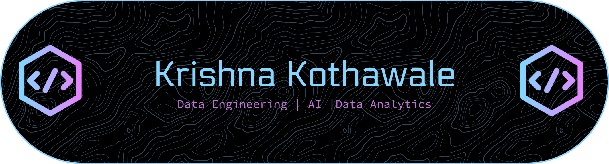

#  About Me:
⚙️ Data Engineer in the making | Building scalable data pipelines and cloud-based data solutions ☁️ Learning Azure, Databricks, and modern Lakehouse architectures one project at a time 📊 Transforming raw data into reliable datasets, actionable insights, and business value 🚀 Focused on Data Engineering, Analytics, and the future of AI-powered data platforms 🧠 SQL • Python • Azure • ETL/ELT • Data Warehousing ⚡ Fun fact: I enjoy finding patterns in data, debugging complex problems, and connecting ideas across different domains

##   Socials:
    

#  Tech Stack:
        
#  GitHub Stats:

 

#  Random Dev Quote

<!-- Proudly created with GPRM ( https://gprm.itsvg.in ) -->
